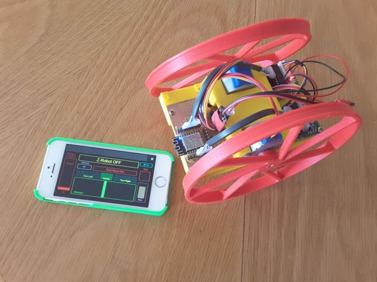
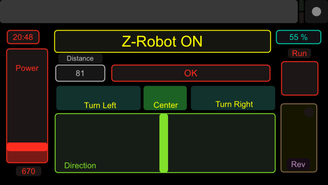

# ESP8266_ZRobot_OSC

EPS8266 based Robot with OSC based remote control. Robot can be controlled by iPhone or Smartphone, both config files are included.
The robot was based on FTobler Thingiverse 3d design http://www.thingiverse.com/thing:1230244

Functionality: The robot code was basically made to test the TOUCHOSC interface. OSC allows to communicate both 
			   ways between ESP8266 and a smart-phone. All code runs on the ESP module (No Arduino Hardware required).
	- "Speed" cursor will define the speed of the step motors advance.
	- "Direction" cursor adds or deducts a value from the speed making the robot turn left-right
	- "Reverse" button inverses the motor rotation = reverse the engine direction like a car.
	- 3 buttons "Turn Left, Center, Turn right" are preprogrammed directions for the robot
	- "RUN" button will start the engine and also stop everything if cancelled.
	- One status line is used to send instructions to the pilot
	- One distance message box will indicate the distance to the next object (to be implemented).
	- Current time and Smartphone battery are shown on the display

###Basic ideas, origin of the project:
	
	-ftobler 3d files printed on Lulzbot TAZ4 printer.
	-two 28byj-48 stepper motors with driver circuit from ebay
	-ESP8266 12E module
	
###Changes, additions:
	- ESP was programmed with Arduino based environment and ESP plug-in
	- Accelstepper library <http://www.airspayce.com/mikem/arduino/AccelStepper/>
	  Tutorial can be found here: https://www.pjrc.com/teensy/td_libs_AccelStepper.html
	- LV-MAXSonar-EZ0 from Sparkfun
	- self made board to hold the ESP module, with 2 push buttons for reset and setting programming mode, 
	  led and connectors for the peripherals.
	- Alternative battery holder to hold a 2S Lipo
	- Alternative motor connections to simplify the wiring on the self made board.

###TouchOSC: 
	I discovered this app by accident when I looked at B-Robot and similar projects. Some tests made with 
	Blynk which looks even more attractive made visible the current advantage of OSC! Easy implementation,
	easy to use windows application to create the GUI, easy to load on a second or alternative platform 
	and sizable widgets which are not yet possible on Blynk made me keep OSC for this project. Maybe I 
	missed something on Blynk, at least it was not immediately visible that the features I missed where 
	available. TouchOSC design tool is available for free from http://hexler.net/software/touchosc, you 
	will need to pay for the user interface you download on your phone or tablet. 
	My current design:

###OSC config: 
			Simple-Z-Robot-Iphone5.touchosc
			Simple-Z-Robot-Samsung.touchosc
	
###Code: ESP8266_ZRobot_OSC.ino includes all __Zrobot__ specific code.

[Schematic/Wiring](schematic.pdf) and eagle files
			
